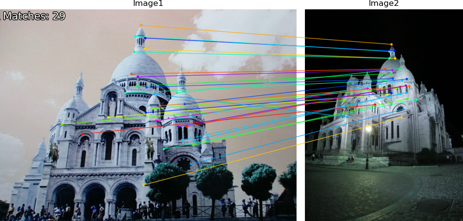

# LightGlue RKNN

Forked from: https://github.com/fabio-sim/LightGlue-ONNX


## Export

#### 导出修改后的 ONNX


```bash
python export.py \
  --img_size 512 512 \
  --extractor_type superpoint \
  --top_nums 512 \
  --end2end
```


#### 导出RKNN


```bash
python export_rknn.py
```


## RKNN Inference

```bash
python infer_end2end.py

```


